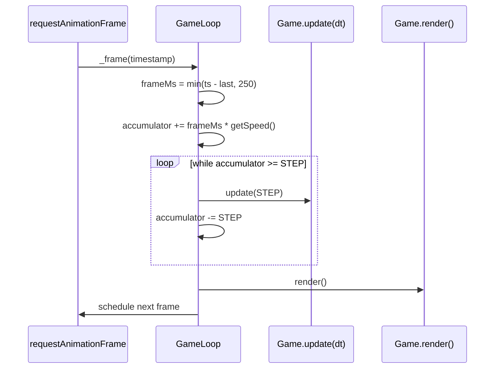

# Towerd Engine Design

A complete specification of the runtime engine: its goals, the time model, the
update and render pipelines, the contracts between modules, and a phased
roadmap to the "impeccable" target. It describes the engine **as built** and
marks every forward-looking proposal explicitly as **[Target]** or **[Roadmap]**
so the document never lies about the current code.

> Companion documents: [`GAME_DESIGN.md`](./GAME_DESIGN.md) (rules, content,
> balance) and [`../ARCHITECTURE.md`](../ARCHITECTURE.md) (the audit/rationale
> for the refactor that produced this engine).

---

## 1. Design goals

The engine is small on purpose. Every decision serves five goals, in priority
order:

1. **Determinism of simulation.** The world advances in fixed discrete steps so
   that behaviour does not depend on the display's frame rate. Two machines
   given the same inputs and the same RNG seed must produce the same world.
   *(RNG seeding is [Roadmap] — see §12.)*
2. **Separation of concerns.** Simulation never draws; rendering never mutates
   state; input never contains rules. Each module has one reason to change.
3. **Data-driven content.** All balance and level data lives in `config.js`.
   Adding a tower, enemy, or level is a data edit, not a logic edit.
4. **Testability without a DOM.** The simulation can be stepped headlessly. The
   only modules that require a browser are `render/`, `ui/`, and `input/`.
5. **Zero runtime dependencies.** Vanilla ES modules bundled by webpack. No
   framework, no game library. The engine is ~1,000 lines and readable end to
   end.

Non-goals (today): networking, physics beyond point/segment distance, a scene
graph, an asset pipeline beyond static SVG. Each appears in the roadmap (§13).

---

## 2. Layered architecture

```
                         ┌──────────────────────────────┐
   Bootstrap             │ index.js                      │  loads assets, builds Game
                         └───────────────┬──────────────┘
                                         │
                         ┌───────────────▼──────────────┐
   Core                  │ core/Game.js (orchestrator)   │  owns state + systems
                         │ core/GameLoop.js (the clock)  │  fixed-timestep driver
                         └───┬───────────┬───────────┬───┘
            ┌────────────────┘           │           └────────────────┐
            │                            │                            │
   ┌────────▼────────┐        ┌──────────▼─────────┐       ┌──────────▼─────────┐
   │ Systems          │        │ Entities           │       │ IO (browser-only)  │
   │ WaveManager      │        │ Tower              │       │ render/Renderer    │
   │ Economy          │        │ Enemy              │       │ ui/Hud             │
   │ EffectsManager   │        │ Projectile         │       │ ui/TowerMenu       │
   │ SpriteLoader     │        │                    │       │ ui/DevMode         │
   └──────────────────┘        └────────────────────┘       │ input/InputManager │
                                                            └────────────────────┘
            config.js  ──────── read-only balance + level data, imported everywhere
```

**Dependency rule:** arrows point downward and inward. `core` may import
`systems`, `entities`, and `io`. `systems` may import `entities` and `config`.
`entities` may import only `config` (and each other where ownership requires it,
e.g. `Tower → Projectile`). Nothing in `systems` or `entities` imports anything
from `render/`, `ui/`, or `input/`. This is what keeps the simulation
DOM-free and unit-testable.

### Module responsibility matrix

| Module | Owns (state) | Reads | Mutates | Browser? |
|---|---|---|---|---|
| `core/Game` | towers, enemies, lives, selection, speed, gameOver | all systems | game state, delegates to systems | no¹ |
| `core/GameLoop` | accumulator, lastTime | speed via callback | nothing (calls update/render) | rAF only |
| `systems/WaveManager` | level, wave, spawn/countdown timers, path | game.gameOver | game.enemies (spawn), triggers level transitions | no |
| `systems/Economy` | gold, interest timer | tower level/type | gold | no |
| `systems/EffectsManager` | floating texts, sell rings | — | its own arrays | no |
| `systems/SpriteLoader` | Image objects | — | — (async load) | `Image` |
| `entities/Tower` | level, cooldown, projectiles, range-anim | enemies (targeting) | enemy.health, enemy effects | no |
| `entities/Enemy` | position, health, status effects | — | own state | no |
| `entities/Projectile` | position, trail | target position | own state | no |
| `render/Renderer` | — | all entity/system state | the 2D context only | yes |
| `ui/Hud` | DOM refs | game state | DOM text | yes |
| `ui/TowerMenu` | — | economy pricing | DOM, calls Game actions | yes |
| `ui/DevMode` | active flag, key buffer | — | game (via actions) | yes |
| `input/InputManager` | — | — | game (via actions) | yes |

¹ `Game` touches the DOM in exactly two pragmatic spots (`_resetSpeedButton`,
and constructing `Hud`/`TowerMenu` which cache DOM refs). See §14 for the
[Target] that removes even these via an event bus.

---

## 3. The time model

This is the heart of the engine and the single largest improvement over the
original code, which mixed `requestAnimationFrame` deltas, `Date.now()`, and
`setInterval` into three uncoordinated clocks.

### 3.1 Fixed timestep with an accumulator

The simulation advances only in increments of `SIM_STEP_MS = 1000/60 ≈ 16.667 ms`.
Each animation frame, real elapsed time (scaled by the speed multiplier) is
added to an accumulator, and the world is stepped as many whole steps as the
accumulator holds:

```
accumulator += min(realFrameMs, MAX_FRAME_MS) * speed
while (accumulator >= STEP) {
    update(STEP)          // exactly one deterministic tick
    accumulator -= STEP
}
render()                  // once per displayed frame
```

Consequences:

- **Frame-rate independence.** A 30 Hz and a 144 Hz display run the same
  simulation; only the number of `render()` calls differs.
- **Speed multiplier is just more steps.** `speed = 2` feeds twice as much time
  into the accumulator, producing twice as many `update` calls per frame. No
  code path special-cases speed — cooldowns, spawns, interest, and movement all
  scale automatically because they are all expressed in `dt`.
- **Pause is `speed = 0`.** `Game` returns a speed of `0` while `gameOver`, so
  the accumulator never fills and `update` is never called — but `render`
  continues, which is how the "GAME OVER" overlay stays on screen.
- **Spiral-of-death guard.** `MAX_FRAME_MS = 250` clamps the time injected after
  a long stall (e.g. a backgrounded tab), so the `while` loop can never try to
  catch up an unbounded number of steps.

### 3.2 One clock, expressed everywhere as `dt`

Every time-dependent value is a millisecond counter decremented by `dt`:

| Concern | Where | Mechanism |
|---|---|---|
| Tower fire rate | `Tower.cooldownRemaining` | `-= dt`, fire when `≤ 0` |
| Enemy spawning | `WaveManager.spawnTimer` | `-= dt`, spawn + `+= spawnInterval` |
| Wave countdown | `WaveManager.countdownMs` | `-= dt` |
| Compound interest | `Economy.interestTimer` | `-= dt`, pay + `+= interval` |
| Burn DoT | `Enemy.burnDuration` | `-= dt`, damage `= dps * dt/1000` |
| Slow expiry | `Enemy.slowDuration` | `-= dt` |
| Range-grow animation | `Tower.rangeAnimRemaining` | `-= dt` |
| Floating text / sell ring | `EffectsManager` | `-= dt` |

Because they share the accumulator's clock, **all of them obey pause and the
speed multiplier, and none can leak** — there is not a single `setInterval` or
`Date.now()` in the simulation.

### 3.3 Movement units

Positions advance by `speed * dt / SIM_STEP_MS`, i.e. *speed* is expressed in
**pixels per 60 Hz step**. Reference values:

| Mover | px/step | px/sec |
|---|---|---|
| Projectile | 8 | 480 |
| `fast` enemy | 3 | 180 |
| `strong` enemy | 1.5 | 90 |
| `slow` enemy | 1 | 60 |

### 3.4 Determinism caveats (current)

- **RNG:** `WaveManager._spawnEnemy` uses `Math.random()` for enemy type, so
  runs are not reproducible. The fix is a small seeded PRNG injected into the
  manager — see §12 and §13.
- **Render interpolation:** `render()` reads raw integer-step positions; it does
  not interpolate by the leftover `accumulator/STEP` fraction. At a 60 Hz sim
  step this is imperceptible, but the hook to add it is documented in §8.3.

---

## 4. The main loop in detail



`getSpeed()` is a closure over `Game` returning `gameOver ? 0 : speedMultiplier`.
The loop is started exactly once, in the `Game` constructor, and never stopped —
"restart" is a state reset (§10), not a new loop.

---

## 5. The update pipeline

`Game.update(dt)` runs systems in a deliberate, fixed order. Order matters
because systems mutate shared arrays that later systems read.

```
1. economy.update(dt)        // accrue interest
2. waves.update(dt)          // spawn enemies / tick countdown  -> may push to game.enemies
3. for tower in towers:      // acquire target, fire, advance projectiles, tick range-anim
       tower.update(dt, enemies)        -> mutates enemy.health and status effects
4. for i = enemies.length-1 .. 0:       // reverse iteration (safe in-place removal)
       enemy.update(dt)                 // move, apply burn/slow
       if enemy.health <= 0:  reward gold, spawn floating text, splice, waves.onEnemyResolved()
       elif enemy.reachedEnd: splice, loseLife(), waves.onEnemyResolved()
5. effects.update(dt)        // advance/expire floating texts & sell rings
6. hud.update(this)          // mirror state into the DOM
```

### Why this order

- **Towers fire before enemies move** so a freshly-spawned enemy is a valid
  target the moment it enters range, with no one-frame delay.
- **Enemy resolution happens after tower fire** so damage dealt this tick is
  reflected in the same tick's life/death decision.
- **Reverse iteration** over `enemies` lets the loop `splice` the current index
  without skipping the next element — the canonical safe in-place filter.
- **`waves.onEnemyResolved()` is the single choke point** for "an enemy left
  play". Both death and leak route through it, so wave-completion accounting can
  never diverge between the two cases (the original code duplicated this and was
  fragile).

### Hazard: mutation during a level transition

When the last enemy of wave 10 resolves, `onEnemyResolved → _completeLevel`
runs **inside** the enemy loop. `_completeLevel` mutates `game.towers` (auto-sell)
and `WaveManager` state, but it does **not** touch the `enemies` array we are
iterating, so the reverse-iteration invariant holds. This adjacency is called
out here because it is the one place where a system mutates sibling state
mid-pipeline; any future change to `_completeLevel` must preserve the rule
"never structurally modify the array currently being iterated."

---

## 6. Entity model

Entities are **plain classes holding state plus the behaviour that mutates that
state**. They contain no canvas, no DOM, and no knowledge of how they are drawn.

| Entity | Identity | Owned by | Lifetime |
|---|---|---|---|
| `Tower` | object reference | `game.towers` | until sold / auto-sold on level clear |
| `Enemy` | object reference | `game.enemies` | until killed / reaches end |
| `Projectile` | object reference | `tower.projectiles` | until it reaches its target |

Design notes:

- **Projectiles are owned by towers, not the Game.** A tower fires, applies
  damage immediately at fire time (hitscan), and spawns a *cosmetic* projectile
  that travels and trails. This keeps damage resolution simple and frame-exact
  while preserving the visual. The projectile holds a reference to its target
  `Enemy`; if that enemy is removed, the projectile's `targetEnemy` still points
  at a detached object and it simply completes its flight to the last known
  position (it is removed next step). This is safe because projectiles never
  mutate the target.
- **Status effects live on the enemy** (`burnDamage/burnDuration`,
  `slowAmount/slowDuration`) and are advanced in `Enemy.update`. Towers only
  *apply* them via `applyBurn` / `applySlow`. "Strongest slow wins" and "latest
  burn refreshes" are the stacking rules.
- **Stats are derived, not stored.** `Tower.range/damage/cooldown` are getters
  computed from `config` and `level`, so a tower can never hold a stat that is
  inconsistent with its level. `recompute()` only caches the animation baseline.

---

## 7. Configuration & data-driven content

`config.js` is the single source of balance truth. It exports pure data: canvas
size, the sim step, economy constants, wave constants, tower scaling, per-tower
and per-enemy tables, and the level layouts/names. No logic.

The contract every consumer relies on:

- Tower entries are keyed by type and carry `cost, range, damage, cooldownMs`,
  plus type-specific effect tables (`burnDpsByLevel`, `slowAmountByLevel`,
  `slowDurationByLevel`) **indexed 0..4 for levels 1..5**.
- Enemy entries carry `speed, baseHealth, fallbackColor`.
- `LEVELS.layouts[i]` is an ordered array of `{x, y}` waypoints; the enemy walks
  them in order and "reaches the end" at the final waypoint. Levels cycle:
  level *n* uses layout `(n-1) % layouts.length`.

See the **Extensibility playbook** (§11) for exactly which fields to add when
introducing content.

---

## 8. Rendering pipeline

`Renderer` is a **pure projection of state onto pixels**. It is the only module
that calls a 2D-context method. It is handed the `ctx` and the loaded `sprites`
once, and exposes verb methods the `Game.render()` orchestrates.

### 8.1 Draw order (back to front)

```
clear()
drawPath(path)                         // the grey road
for tower in towers: drawTower(...)    // range ring (if selected) -> sprite -> glow -> badge -> MAX, then its projectiles
for enemy in enemies: drawEnemy(...)   // sprite/fallback -> health bar -> burn/slow auras
drawEffects(effects)                   // floating text -> sell rings
drawWaveInfo(...)                      // enemies counter, gold/kill, countdown banner
if gameOver: drawGameOver(...)         // dim overlay + summary
```

Towers draw their own projectiles so trails sit above the road but below
enemies' health bars, matching the original look.

### 8.2 Statelessness

The renderer caches nothing about the world between frames; given the same state
it produces the same frame. The only mutable thing it touches is the context
(and it always resets `shadowBlur`/`globalAlpha` it sets). This is what allows a
future headless image-diff test to assert pixel-stable output.

### 8.3 **[Target]** render interpolation

To make motion perfectly smooth at very high refresh rates, `render()` can take
the loop's leftover `alpha = accumulator / STEP` and draw each mover at
`prev + (curr - prev) * alpha`. This requires entities to keep their previous
position (`prevX/prevY`, snapshotted at the top of `update`). The hook: change
`GameLoop` to pass `alpha` to `render`, and have `Renderer` lerp positions. Left
out today because the visual gain at a 60 Hz step is negligible and it would add
state to every entity.

---

## 9. Input & event model

`InputManager` binds DOM events **once** and translates them into semantic
`Game` actions — it contains no game rules.

| Event | Action |
|---|---|
| `.tower-btn` click | `game.selectTowerType(type)` (no-op if unaffordable) |
| canvas click, game over | `game.reset()` |
| canvas click, type selected | `game.handleCanvasClick` → place if `canPlaceTower` |
| canvas click, nothing selected | select tower under cursor → `TowerMenu.show`, else deselect |
| document click outside canvas/menu | `game.deselectTower()` |
| `#fast-forward` click | `game.toggleSpeed()` → update button label |

Selection state (`selectedTower`, `selectedTowerType`) lives on `Game` because
both input (writes it) and the renderer (reads it to draw range rings) need it.

`TowerMenu` and `DevMode` are the two UI modules that initiate actions: the menu
wires its upgrade/sell buttons to `game.upgradeTower/sellTower`; dev mode maps
keys to `game` mutations and `waves.jumpToLevel`.

---

## 10. State & lifecycle

The engine constructs **one** `Game` for the life of the page. There is no
"new game = new object."

```
boot()                       // index.js, after sprites load
  └─ new Game(canvas, ctx, sprites)
       ├─ construct systems, renderer, ui, input   (input bound ONCE here)
       ├─ reset()                                   (initial world)
       └─ loop.start()                              (the only rAF loop)

reset()                      // also called on click-to-restart after game over
  ├─ clear towers/enemies/selection, speed=1, gameOver=false, lives=start
  ├─ economy.reset(); effects.reset(); waves.reset()
  └─ towerMenu.hide(); reset fast-forward button; hud.update()
```

Because listeners and the loop are bound once and `reset()` only rewrites state,
restarts cannot stack duplicate handlers or leak timers — the precise failure
mode of the original `new Game()`-from-a-click-handler restart.

### 10.1 **[Target]** explicit game-state machine

Today "what state are we in" is implied by booleans (`gameOver`,
`waveInProgress`, `countdownMs > 0`). The target is a tiny enum state machine —
`BOOT → PLAYING → PAUSED → GAME_OVER` — owned by `Game`, with the loop and
input keying off the current state. This makes adding a real pause, a start
menu, or a victory screen a state addition rather than another boolean.

---

## 11. Extensibility playbook

The measure of the architecture is how little you touch to add content.

**Add a tower type** (e.g. `ice`):
1. Add an `ice` entry to `TOWERS` in `config.js` (cost, range, damage,
   cooldown, effect table, colors).
2. If it has a *new* effect (not burn/slow), add an `applyX` method to `Enemy`
   and advance it in `Enemy.update`, then call it from `Tower.shoot`.
3. Add an `ice` sprite + import in `index.js` and `SpriteLoader`.
4. Add a `.tower-btn[data-type="ice"]` button in `index.html` + its CSS icon.
   *No change to the loop, renderer core, economy, or waves.*

**Add an enemy type:** add an entry to `ENEMIES` and `ENEMY_TYPES`, add a
sprite. Spawning, scaling, health bars, and targeting all pick it up.

**Add a level:** append a waypoint array to `LEVELS.layouts` and a name to
`LEVELS.names`. Levels cycle automatically.

**Add a system** (e.g. particles, achievements): create `systems/Xxx.js` with
`reset()` and `update(dt)`, instantiate it in `Game`, and call it in the
pipeline at the right point. If it draws, add a `drawXxx` to `Renderer`.

**Tune balance:** edit `config.js` only. Every lever in `GAME_DESIGN.md §13`
maps to a field here.

---

## 12. Testing strategy

The DOM-free simulation is the testable surface.

- **Unit (systems/entities):** instantiate `Economy`, `Tower`, `Enemy`,
  `WaveManager` directly and assert on state after `update(dt)` calls. e.g.
  *"a level-3 fire tower kills a wave-1 fast enemy in N ticks"*, *"interest pays
  `floor(gold*0.07)` every 6000 ms of `dt`"*, *"reverse-resolving 10 enemies
  advances wave from 1→2 with a 5 s countdown."* None need a canvas.
- **Headless integration:** drive the built bundle in Chromium (the approach
  already used to verify the refactor) — assert HUD values, that placement
  debits gold, the menu opens, fast-forward toggles, and there are zero console
  errors.
- **[Roadmap] Golden simulation tests:** with a seeded RNG (§13), run K ticks
  from a fixed scenario and assert a hash of world state — catches any
  unintended balance or logic drift.
- **[Roadmap] Golden image tests:** because `Renderer` is pure, snapshot a frame
  and image-diff it.

---

## 13. Performance profile & scaling

Current scale (a few dozen entities) is trivially within budget; the loop is
O(towers × enemies) for targeting and O(enemies) for movement. The honest
bottleneck if the game grew is **targeting**: every tower scans every enemy
every fire check.

**[Roadmap], in priority order:**
1. **Object pooling** for projectiles and enemies to remove per-wave GC churn.
2. **Spatial partitioning** (a uniform grid bucketed by cell) so a tower queries
   only enemies in nearby cells instead of the whole array — turns targeting
   from O(T×E) into roughly O(T×k).
3. **Layered canvases** — a static layer for the path (drawn once per level) and
   a dynamic layer for entities — to stop repainting the road every frame.
4. **Optional render interpolation** (§8.3) for high-refresh smoothness.

None are needed at current scale; they are listed so the growth path is known.

---

## 14. **[Roadmap]** Engine evolution

Phased, each phase independently shippable and ordered by value-to-risk:

- **Phase 1 — Event bus.** Replace the direct `hud.update(this)` calls and the
  Game→DOM touches with an event emitter (`enemy:killed`, `gold:changed`,
  `wave:changed`, `game:over`). HUD/effects subscribe. Removes the last DOM
  coupling from `Game` and makes the simulation fully headless.
- **Phase 2 — Seeded RNG + golden tests.** Inject a deterministic PRNG into
  `WaveManager`; add the golden-sim tests from §12. Unlocks reproducible runs.
- **Phase 3 — Explicit state machine + real pause** (§10.1) and a start/victory
  screen.
- **Phase 4 — Save/Load.** Because all simulation state is plain data, a
  serializer over `Game` + systems gives suspend/resume and replays.
- **Phase 5 — Performance** (pooling, spatial grid, layered canvas) when entity
  counts justify it.
- **Phase 6 — ECS migration (optional).** If content explodes (many tower
  behaviours, many status effects), migrate entities to a component/system model
  so behaviours compose as data. The current class model is correct for the
  present content count; ECS is only warranted past a complexity threshold, and
  this engine's clean update pipeline makes that migration mechanical.

---

## 15. File map

```
src/
  index.js               Bootstrap: size canvas, load sprites, build Game
  config.js              All balance + level data (no logic)
  core/
    Game.js              Orchestrator: state, systems, pipeline, actions, lifecycle
    GameLoop.js          Fixed-timestep accumulator loop
  entities/
    Tower.js             Derived stats, cooldown firing, owns projectiles, range-anim
    Enemy.js             Path movement, burn/slow status effects
    Projectile.js        Cosmetic homing travel + trail
  systems/
    WaveManager.js       Spawning + wave/level progression (dt-driven)
    Economy.js           Gold, interest, pricing, rewards
    EffectsManager.js    Floating text + sell-ring animations
    SpriteLoader.js      Async asset loading
  render/
    Renderer.js          The only 2D-context consumer
  ui/
    Hud.js               DOM stat readout
    TowerMenu.js         DOM upgrade/sell menu
    DevMode.js           Hidden dev controls
  input/
    InputManager.js      DOM events -> Game actions (bound once)
```
